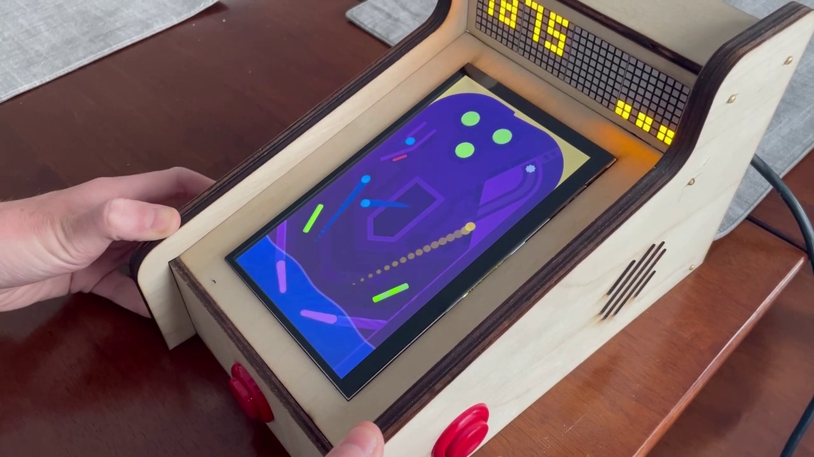

# Mini Pinball Machine
A mini pinball machine based on the Raspberry Pi 4 with a laser-cut enclosure and custom software.

The hardware enclosure is laser-cut wood, a 7" touchscreen monitor, and an Arduino to interact with the dot-matrix display and arcade buttons.  The enclosure also has stereo audio.

A Raspberry Pi 4 runs a custom-designed pinball game which interacts with the physical hardware. The game contains several powerups, high scores, and is optimized to run at 60fps.

**This repository holds the video game code for the machine.**

- For a detailed writeup, see https://www.chrisdalke.com/projects/mini-pinball-machine/
- For a demo video, see https://www.youtube.com/watch?v=iiBn7FVzlcc

 

